Target Brazil E-Commerce SQL Business Case Analysis

Project Overview :

This project presents a complete SQL business case analysis of Target’s e-commerce operations in Brazil using Google BigQuery. The dataset contains approximately 100,000 orders placed between 2016 and 2018, along with customer, payment, freight, seller, product, and delivery-related information.
The goal of this project is to analyze operational and commercial performance across multiple business dimensions and convert raw transactional data into strategic insights.
This analysis focuses on:
•	customer purchasing behavior
•	regional demand distribution
•	order growth trends
•	sales and revenue patterns
•	freight and delivery efficiency
•	payment preferences and installment usage
The final outcome is a set of data-driven recommendations to support business growth, improve customer experience, and optimize operations in the Brazilian market.

## Project Visuals

### Dataset Schema
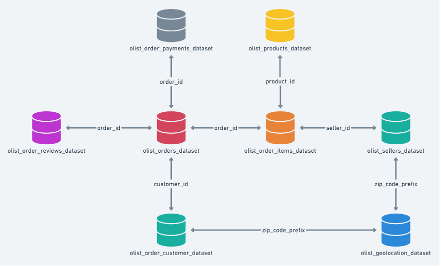

### Order Growth Trend
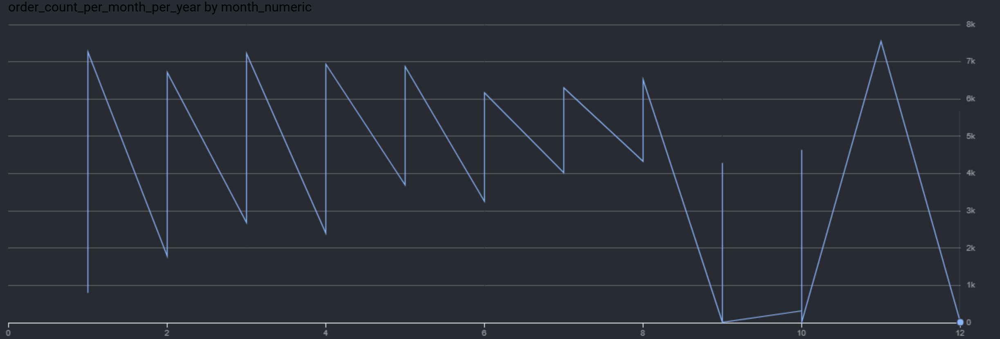

### Monthly Seasonality
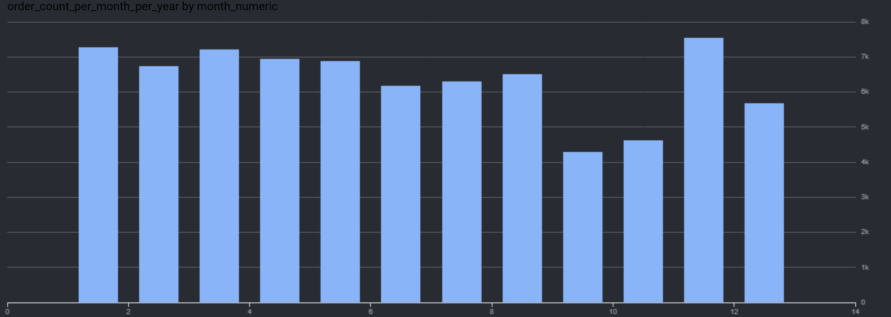

### Orders by Time of Day
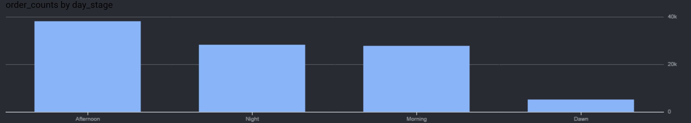

### Orders by Payment Type
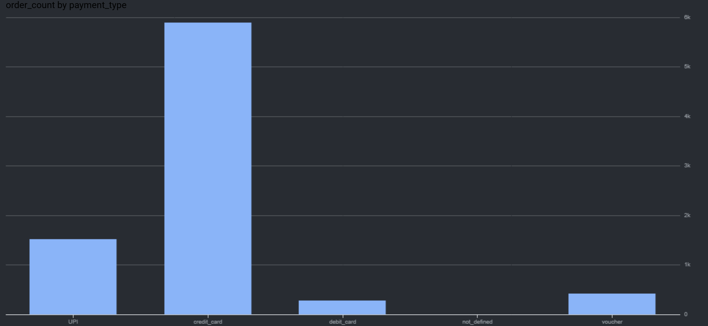

### Customer Distribution by State
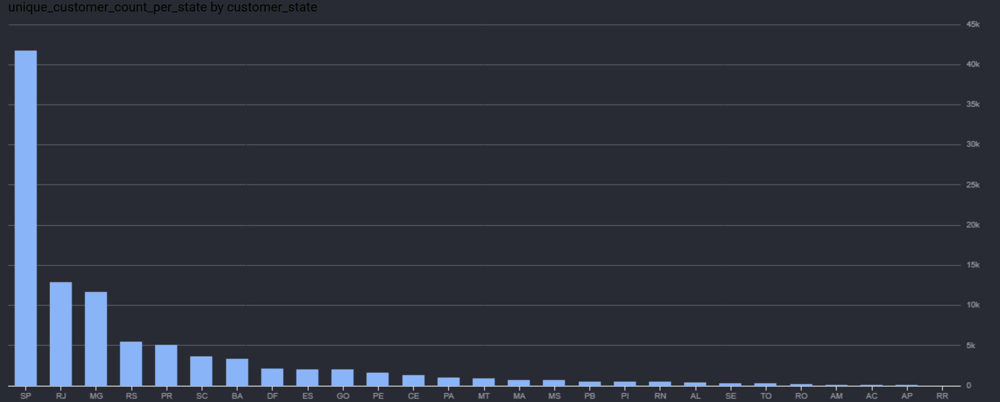

### Delivery Time Analysis
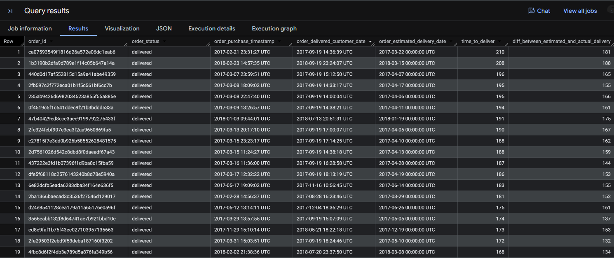

### Delivery Time by State
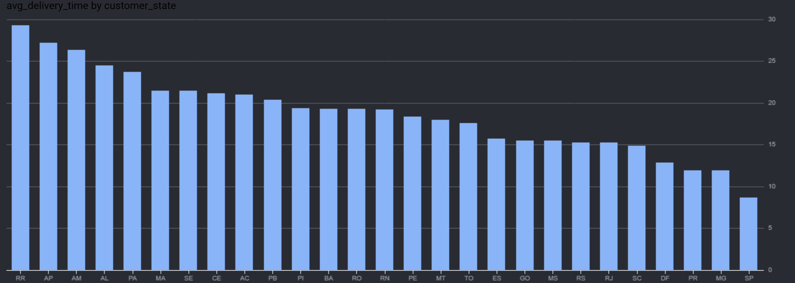

### Fast Delivery States
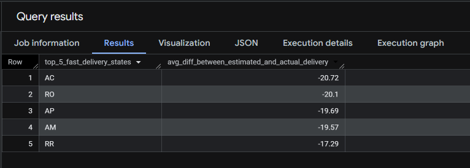

### Freight Value by State
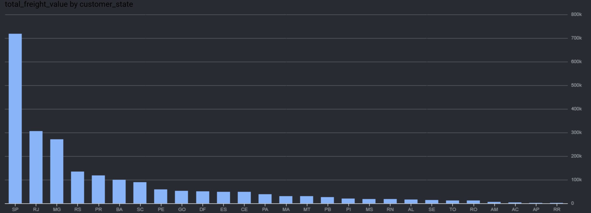

### Orders Time Range
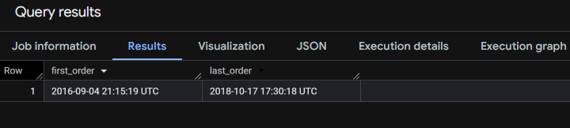

Business Problem:

Target wants to assess the performance of its e-commerce business in Brazil and determine what actions should be taken to:
•	increase order volume
•	improve revenue generation
•	understand customer demand by region
•	optimize freight and delivery operations
•	improve the customer experience
•	support strategic expansion in high-potential markets
This project answers those questions through SQL-based analysis of transactional e-commerce data.

Dataset:

The dataset used in this project was provided by SCALER for my Data Science and Machine Learning with specialization in AI program use.
Source: Google Drive folder - https://drive.google.com/drive/folders/1TGEc66YKbD443nslRi1bWgVd238gJCnb
The project uses a relational e-commerce dataset containing approximately 100,000 orders from Brazil.
Main tables used
•	customers
•	orders
•	order_items
•	payments
•	products
•	sellers
•	geolocation
•	order_reviews
Data includes
•	customer city and state
•	order purchase timestamps
•	order status
•	payment type and installments
•	order value and freight charges
•	seller and product-level details
•	actual and estimated delivery dates
Time period covered
September 2016 to October 2018
The dataset follows a relational schema with multiple linked tables connected through primary and foreign keys.

Tools & Technologies:

•	SQL
•	Google BigQuery
•	BigQuery INFORMATION_SCHEMA
•	Window Functions
•	Subqueries
•	CTEs
•	Date & Time Functions
•	GitHub
Database & SQL Concepts
This project demonstrates both foundational and advanced SQL concepts, including:
•	data exploration
•	filtering and sorting
•	joins
•	aggregations
•	subqueries
•	common table expressions (CTEs)
•	window functions
•	ranking functions
•	date and time analysis
•	business KPI analysis
•	primary key and foreign key relationships
•	relational schema understanding
It also reflects practical DBMS knowledge through work with normalized transactional data and interconnected business entities.

Analysis & Queries:

1. Data Exploration
Initial exploration was performed to understand the structure and scope of the dataset.
Tasks included: - checking data types using INFORMATION_SCHEMA - finding the order date range - counting unique customer cities and states

2. Data Cleaning
The dataset required minimal preprocessing, but analytical filters were applied to ensure accurate business analysis.
Examples: - excluding null delivery timestamps from delivery calculations - restricting delivery analysis to delivered orders - filtering payment installments where required - using Jan–Aug for year-over-year comparisons for consistency

3. Basic SQL Queries
Basic SQL was used to answer foundational business questions such as: - how order volume changed over time - how customers are distributed across states - what time of day customers place the most orders - how payment installment patterns vary

4. Joins
Joins were used extensively to combine information across multiple tables.
Examples: - orders + customers for regional demand analysis - orders + payments for revenue and payment behavior - orders + order_items + customers for freight analysis by state - orders + customers for delivery analysis across regions

5. Aggregations
Aggregations were used to summarize key metrics across geography and time.
Examples: - COUNT() for order and customer counts - SUM() for payment value and freight cost - AVG() for order value, freight value, and delivery time

6. Subqueries
Subqueries were used to solve layered analytical questions and intermediate calculations.
Examples: - percentage increase in payment value from 2017 to 2018 - state ranking by freight cost - intermediate calculations for trend and delivery performance

7. CTEs
CTE-style logic can be applied to improve readability and maintainability in multi-step analyses such as: - delivery time calculations - regional ranking - order growth tracking - revenue comparisons

8. Window Functions
Window functions were a major part of the project and were used for ranking and trend analysis.
Examples: - cumulative monthly growth using SUM() OVER() - month ranking using FIRST_VALUE() - state ranking using ROW_NUMBER()
These functions helped answer deeper business questions more efficiently.

9. Advanced SQL
Advanced SQL techniques were used to analyze: - monthly order trends and seasonality - customer ordering behavior by time of day - actual vs estimated delivery performance - top and bottom states by freight cost - top and bottom states by average delivery time - revenue growth over time - payment preferences and installment behavior

10. DBMS Concepts
This project reflects practical DBMS concepts such as: - understanding normalized relational data - working with linked business tables - using keys to combine transactional records - querying structured data at scale in BigQuery - converting raw database records into business intelligence

Key Findings:

•	The dataset covers Target’s Brazil e-commerce activity from September 2016 to October 2018.
•	Customers placed orders from 4,000+ cities across 27 states, showing strong national coverage.
•	Sao Paulo, Rio de Janeiro, and Minas Gerais consistently recorded the highest order volume.
•	Order volume showed overall growth over time, although a perfectly stable seasonal pattern was not observed across all years.
•	Customers most frequently placed orders during the afternoon (1 PM to 6 PM).
•	Revenue increased significantly in 2018 compared with 2017 for the Jan–Aug comparison period.
•	States with higher order volumes also generated higher total payment values.
•	Freight cost and delivery performance varied considerably across states, suggesting differences in logistics efficiency.
•	Some states consistently received deliveries earlier than the estimated delivery date, indicating stronger fulfillment performance.
•	Credit card was the most commonly used payment method, especially because of installment-based purchasing behavior.

Recommendations:

1. Prioritize high-potential markets
Increase marketing, fulfillment, and logistics investments in: - Sao Paulo - Rio de Janeiro - Minas Gerais
These regions contribute the highest demand and revenue.
2. Target afternoon purchase behavior
Schedule promotions, ad campaigns, and personalized offers during afternoon hours when customer ordering activity is highest.
3. Improve logistics and delivery operations
Enhance route planning, warehouse coordination, and order processing efficiency to reduce delays and improve delivery performance.
4. Optimize warehouse placement
Position inventory closer to high-demand areas to reduce freight costs and speed up deliveries.
5. Maintain flexible payment options
Continue supporting credit card installments and convenient digital payment methods aligned with customer preferences.
6. Improve inventory planning
Use historical order patterns to forecast demand and reduce stockouts in high-demand regions.
7. Improve customer communication
Provide clearer order status updates and delivery timelines to improve trust and overall customer experience.
8. Continue data-driven monitoring
Regularly analyze orders, revenue, logistics, payments, and customer behavior to guide future business decisions.

Why This Project Stands Out:

This project is portfolio-ready because it demonstrates:
•	end-to-end business case analysis using SQL
•	practical use of BigQuery for analytical querying
•	strong understanding of joins, aggregations, subqueries, and window functions
•	ability to translate data into strategic recommendations
•	a balance of technical SQL skills and business problem-solving

How to Use This Project:

1.	Upload or access the dataset in Google BigQuery
2.	Open the SQL script inside the sql/ folder
3.	Update dataset/table references if needed
4.	Run the queries in BigQuery to reproduce the analysis
5.	Review the visual outputs in images/ and the full report in docs/
   
Notes:
•	SQL syntax is written for BigQuery
•	Delivery analysis uses valid delivered orders only

Author:

Samia Jahan Ilma
Data Analytics | Data Scientist | ML | AI
•	GitHub: samiajahanilma
•	LinkedIn: Samia Jahan Ilma

